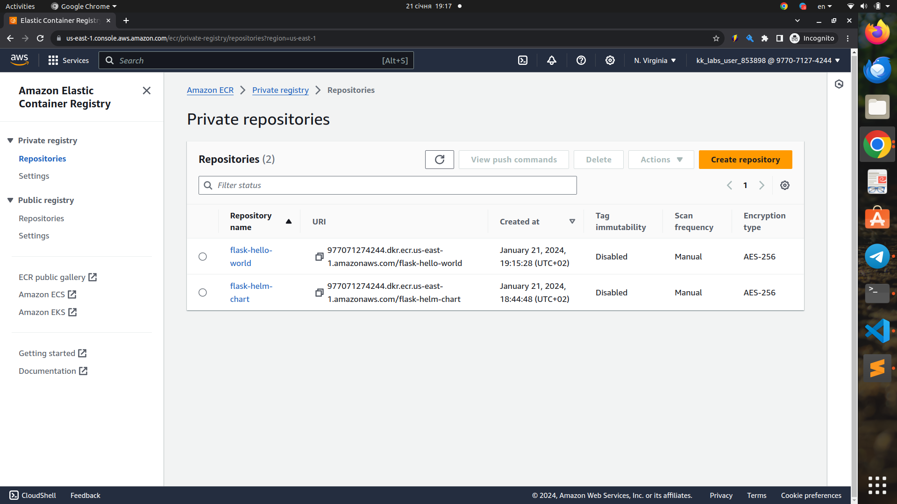
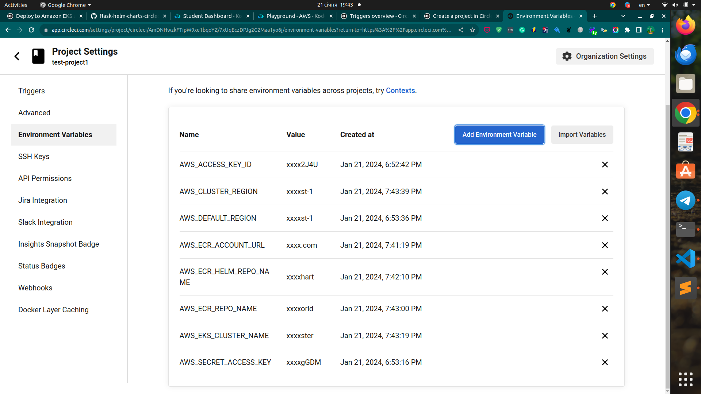
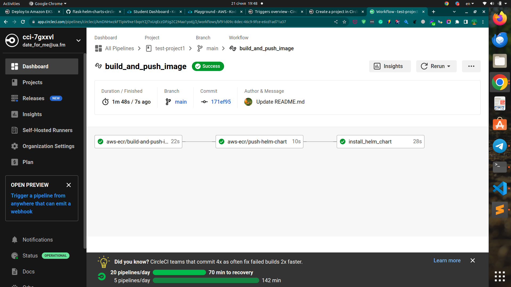

# flask-helm-charts-circleci


## Local set up

During development, if you would like to test the setup locally, you will need to set up a few additional things:

- Install Docker for building Docker images locally (https://docs.docker.com/engine/install/).
- Install kubectl for testing the cluster locally (https://kubernetes.io/docs/tasks/tools/).
- Install AWS CLI and configure AWS credentials (https://docs.aws.amazon.com/cli/latest/userguide/getting-started-install.html).
- Install eksctl for managing Kubernetes clusters on Amazon EKS (https://docs.aws.amazon.com/eks/latest/userguide/eksctl.html).

## AWS set up

You could use existing resources in your account or provision new resources if you don’t have them created.

- Create a AWS ECR repository for hosting your Flask Docker images (https://docs.aws.amazon.com/AmazonECR/latest/userguide/repository-create.html).
- Create a AWS ECR repository for hosting your Helm chart (https://docs.aws.amazon.com/AmazonECR/latest/userguide/repository-create.html).
- Create an AWS ECR cluster for running your Kubernetes workload.

This example project uses CircleCI for CI/CD.
Make sure that you use the same IAM user for creating the cluster and configuring the credentials on CircleCI.

## Helm usage with AWS Services

Update the values.yaml file with values corresponding to your application and AWS configs.




## In general, workflow should look like this:

1. First login to account

```
aws ecr get-login-password --region <AWS_REGION> | docker login --username AWS --password-stdin <AWS_ACCOUNT_ID>.dkr.ecr.<AWS_REGION>.amazonaws.com
```
2. Tag the Docker image you have already built

```
docker tag flask-hello-world:latest <AWS_ACCOUNT_ID>.dkr.ecr.<AWS_REGION>.amazonaws.com/flask-hello-world
```
3. Push the Docker image to the AWS ECR repository

```
docker push <AWS_ACCOUNT_ID>.dkr.ecr.<AWS_REGION>.amazonaws.com/flask-hello-world:latest
```

4. Before pushing the Helm chart you need to authenticate helm with AWS ECR.

```
aws ecr get-login-password --region us-west-2 | helm registry login --username AWS --password-stdin <AWS_ACCOUNT_ID>.dkr.ecr.<AWS_REGION>.amazonaws.com
```

5. Package the Helm chart

```
helm package charts
```

6. Push the Helm chart to AWS ECR repository 

```
helm push flask-helm-chart-0.1.0.tgz oci://<AWS_ACCOUNT_ID>.dkr.ecr.<AWS_REGION>.amazonaws.com/
```
7. Install the chart to the EKS cluster
```
helm install flask-helm oci://<AWS_ACCOUNT_ID>.dkr.ecr.<AWS_REGION>.amazonaws.com/flask-helm-chart --version 0.1.0
```
8. Set up project in CircleCI with appropriate variables




